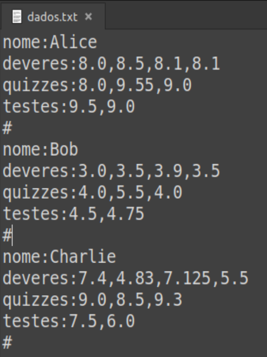
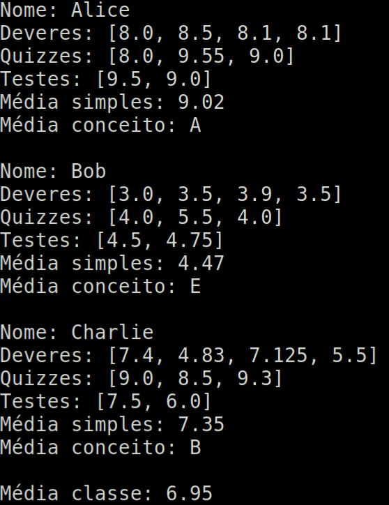

# notas_final.py

**notas_final.py** foi um exercício feito para a matéria de algoritmo da FATEC sjc.
Ele recebe um arquivo .txt de informado na linha de comando:

```
$ python3.7 notas_final.py dados.txt
```
O arquivo deve seguir esse template(o número de notas pode aumentar ou diminuir e a quantidade de alunos pode ser alterada):



E o output:


